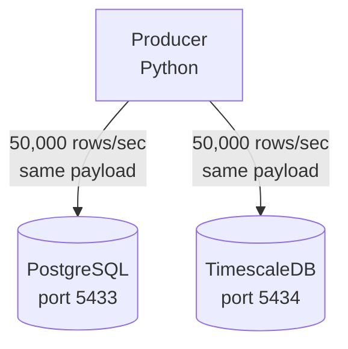

# TimescaleDB vs PostgreSQL — Time-Series Query Performance

This project benchmarks **TimescaleDB** against **vanilla PostgreSQL** on time-series analytical queries — specifically, filtering by time and device then aggregating with `GROUP BY`.

## I. Performance conparison — Scan + GroupBy

TimescaleDB vs PostgreSQL on the query:

```sql
SELECT activity, count(*) as cnt
FROM events
WHERE time > now() - INTERVAL '10 minute'
  AND device = 'iPhone'
GROUP BY activity
ORDER BY cnt DESC;
```

With **28 million rows** in each database, TimescaleDB runs it **~21× faster** on average:

| Query | Total rows | Rows scanned | PostgreSQL | TimescaleDB | Speedup |
|---|---|---|---|---|---|
| 5 min + device filter | 28M | ~1.4M | 2,774 ms | **60 ms** | **45.9×** |
| 3 min + device filter | 28M | ~800K | 449 ms | **34 ms** | **13.1×** |
| 1 min + device filter | 28M | ~300K | 161 ms | **32 ms** | **5.0×** |

The gap widens as the time window grows — more chunks, more compression leverage.

## II. Why Is TimescaleDB Faster?

Both optimizations are configured right in the init SQL (`init-scripts/timescaledb.sql`) — no application code changes needed.

### 1. Hypertable Chunking

TimescaleDB transparently partitions the `events` table into **1-minute chunks**, sub-partitioned by `device`. A query filtering `device = 'iPhone'` touches only ~1/4 of the data. Each chunk has its own small, focused index — scanning many small indexes in parallel is far cheaper than traversing one giant index.

```sql
-- From init-scripts/timescaledb.sql
SELECT create_hypertable('events', 'time',
    chunk_time_interval => INTERVAL '1 minute',
    partitioning_column => 'device',
    number_partitions   => 4
);
```

### 2. Hybrid Row + Columnar Compression

TimescaleDB uses a **hybrid storage model**:

- **Recent chunks** (the last minute) stay in **row format** — ideal for high-throughput inserts (50,000 rows/sec).
- **Older chunks** auto-convert to **columnar storage** — each column is stored separately and compressed with type-specific encoding (delta-of-delta for timestamps, dictionary encoding for text, then a final ZSTD pass).

```sql
-- From init-scripts/timescaledb.sql
ALTER TABLE events SET (
    timescaledb.compress,
    timescaledb.compress_segmentby = 'device',
    timescaledb.compress_orderby   = 'time DESC'
);

SELECT add_compression_policy('events', INTERVAL '1 minute');
```

When a query hits compressed chunks, it reads **only the columns it needs** (`time` and `activity` — never touching `uid` or `screen`). Postgres must read entire rows regardless. On top of that, filtering and aggregation run via **SIMD vectorized operations** (`Vectorized Filter` + `VectorAgg`), comparing 8–16 values at once instead of row-by-row.

> **Net result:** fast writes land in the live row-based chunk, while analytical queries blaze through older compressed chunks using columnar vector scans.

## III. Architecture



- **2 databases**: one vanilla PostgreSQL 16, one TimescaleDB (PostgreSQL 16 + extension).
- **1 producer**: a Python script that generates synthetic event data and inserts the **exact same rows** into both databases at the same rate.
- Both databases run with identical resource limits (3 CPU, 6 GB RAM).

## IV. How to Run

### 1. Start the stack

```bash
docker compose up -d --build
```

This launches three containers:
- `postgres` — vanilla PostgreSQL
- `timescaledb` — TimescaleDB
- `producer` — the Python data generator (waits for both databases to be healthy, then starts inserting)

### 2. What the init scripts do

On first startup, each database runs its init SQL:

**PostgreSQL** (`init-scripts/postgres.sql`):
- Creates the `events` table
- Creates indexes on `time`, `uid`, `activity`, and `device`

**TimescaleDB** (`init-scripts/timescaledb.sql`):
- Enables the TimescaleDB extension
- Creates the same `events` table
- Converts it to a **hypertable** partitioned by `time` (1-minute chunks) and `device` (4 partitions)
- Enables **compression** — segmenting by `device`, ordered by `time DESC`
- Sets a **compression policy** that auto-compresses chunks older than 1 minute

> These two steps — hypertable chunking + compression — are the entire reason for the performance gap. They require no query changes; the same SQL runs on both databases.

### 3. Let data accumulate

Let the producer run for **a few minutes** to build up a meaningful dataset. After ~20 minutes you'll have about 60 million rows in each database. Even 2–3 minutes is enough to see a significant difference.

### 4. Run the benchmark

```bash
./explain-then-compare.sh
```

This script runs `EXPLAIN ANALYZE` on both databases for the same query, then measures raw execution time and prints the speedup ratio.

## V. For the Full Story

Read [`report.md`](report.md) for:
- Detailed query plan comparison (EXPLAIN ANALYZE output side-by-side)
- Deep dive into hypertable chunking and columnar compression internals
- Explanation of vectorized filtering and aggregation (SIMD)
- How the compression metadata index avoids touching raw data rows
